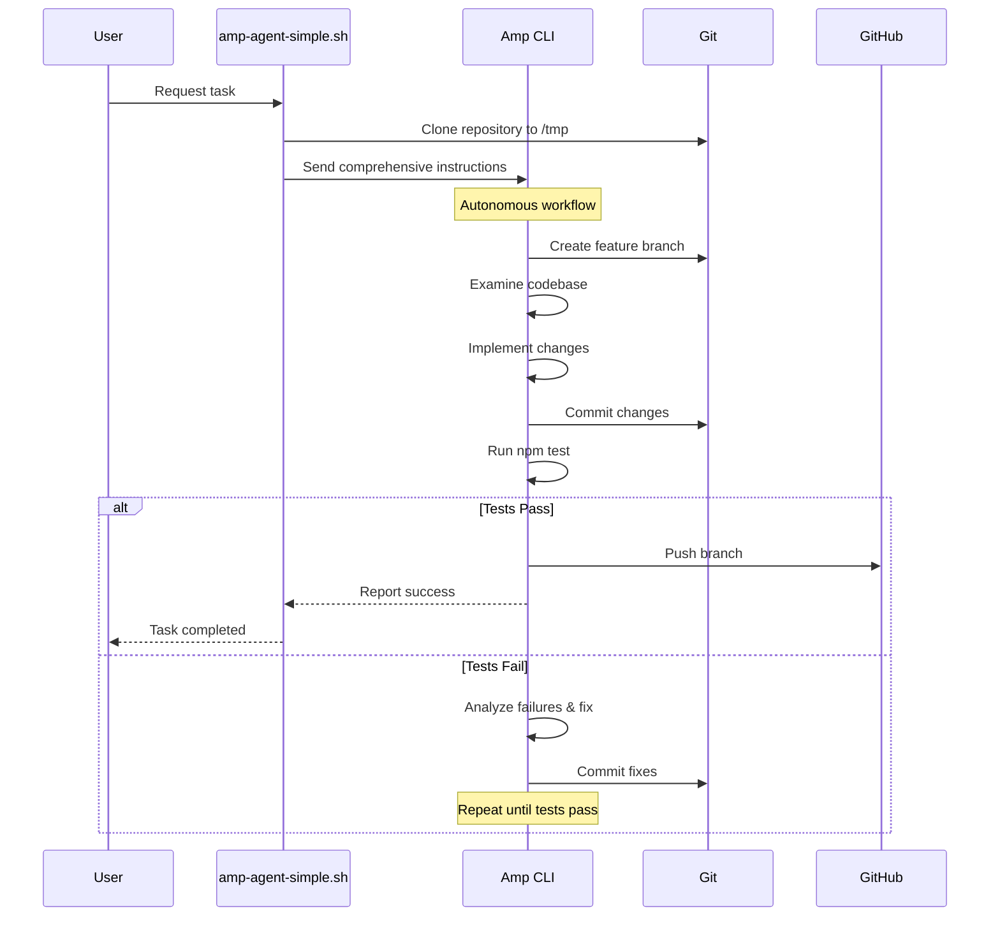

# CI-Feedback Loop Demo

A demonstration of using Continuous Integration as a feedback loop for AI agents in enterprise software development lifecycle (SDLC).

## Overview

This demo shows how an AI agent (Amp CLI) can autonomously:

1. Clone a repository and examine the codebase
2. Create feature branches and implement changes
3. Run tests locally and fix issues iteratively
4. Push only when all CI checks pass
5. Create branches ready for team review

The key insight is that AI agents can use CI as a feedback mechanism to validate their work before human review, enabling autonomous code contributions in enterprise environments.

## Architecture



## Components

- [`scripts/amp-agent-simple.sh`](scripts/amp-agent-simple.sh) - Main orchestrator script
- [`.github/workflows/ci.yml`](.github/workflows/ci.yml) - GitHub Actions CI workflow
- [`src/`](src/) - Sample application code with intentional bugs
- [`tests/`](tests/) - Test suite that will catch bugs

## Quick Start

1. **Ensure Amp CLI is installed and configured:**

   ```bash
   # Check if amp is available
   amp --version

   # Make sure git commands are allowed (see Prerequisites section)
   ```

2. **Run the demo:**

   ```bash
   ./scripts/amp-agent-simple.sh \
     --task "fix the power function to handle negative exponents correctly" \
     --repo git@github.com:brettsmith212/ci-test.git
   ```

3. **Watch Amp work autonomously:**
   - Clones repo to /tmp
   - Examines codebase structure
   - Creates feature branch
   - Fixes the bug
   - Runs tests until they pass
   - Pushes branch to origin

## Prerequisites

- **Amp CLI** - The AI coding agent ([installation guide](https://github.com/sourcegraph/amp))
- **Git** - Configured with push access to target repository
- **Amp Command Allowlist** - Configure Amp to allow git commands by adding this to `~/.config/amp/settings.json`:
  ```json
  {
    "amp.mode": "connected",
    "amp.commands.allowlist": [
      "git checkout -b *",
      "git switch -c *",
      "git add .",
      "git add *",
      "git commit -m *",
      "git commit -am *",
      "git push origin *",
      "npm test",
      "npm run *",
      "node -e *"
    ]
  }
  ```

## Usage

### Basic Usage

```bash
./scripts/amp-agent-simple.sh --task "TASK_DESCRIPTION" --repo "REPO_URL"
```

### Examples

```bash
# Fix a specific bug
./scripts/amp-agent-simple.sh \
  --task "fix the power function to handle negative exponents correctly" \
  --repo git@github.com:brettsmith212/ci-test.git

# Add a new feature
./scripts/amp-agent-simple.sh \
  --task "add input validation to the calculator add method" \
  --repo git@github.com:your-org/your-repo.git

# Refactor code
./scripts/amp-agent-simple.sh \
  --task "convert the Calculator class to use TypeScript" \
  --repo https://github.com/your-org/your-repo.git
```

### Available Options

| Option   | Description                       | Required |
| -------- | --------------------------------- | -------- |
| `--task` | Natural language task description | Yes      |
| `--repo` | Git repository URL (SSH or HTTPS) | Yes      |
| `--help` | Show usage information            | No       |

## How It Works

1. **Clone & Setup**: Script clones the repository to a temporary directory
2. **Autonomous Agent**: Amp receives comprehensive instructions to work independently
3. **Code Analysis**: Amp examines the codebase structure and understands the project
4. **Branch Creation**: Amp creates a feature branch with timestamp
5. **Implementation**: Amp makes the requested code changes
6. **Local Testing**: Amp runs `npm test` and other CI commands locally
7. **Iterative Fixes**: If tests fail, Amp analyzes output and fixes issues
8. **Push When Ready**: Only pushes to origin when all tests pass
9. **Branch Ready**: Creates a branch ready for team review and PR creation

## Example Tasks

The demo includes a sample JavaScript project with intentional bugs perfect for testing:

- **Bug Fix**: "fix the power function to handle negative exponents correctly"
- **Input Validation**: "add input validation to the calculator methods"
- **Code Quality**: "add JSDoc comments to all functions"
- **Performance**: "optimize factorial function to use iteration"
- **TypeScript**: "convert JavaScript to TypeScript with type definitions"

## Sample Output

When you run the script, you'll see Amp working autonomously:

```
ℹ️  Starting Amp CI-Feedback Loop Agent
ℹ️  Task: fix the power function to handle negative exponents correctly
ℹ️  Repo: git@github.com:brettsmith212/ci-test.git
ℹ️  Working directory: /tmp/amp-agent-1748710711
ℹ️  Cloning repository...
ℹ️  Sending task to Amp...
ℹ️  Waiting for Amp to complete the workflow...

[Amp examines codebase, creates branch, fixes bug, runs tests, pushes branch]

✅ Amp completed the task successfully!
ℹ️  Check the repository for the new feature branch with your changes.
```

## Safety Features

- **Isolated Execution**: Uses temporary directories for all operations
- **Local Testing**: Verifies all tests pass before pushing
- **Command Allowlist**: Only allows pre-approved git/npm commands
- **Automatic Cleanup**: Removes temporary files on completion

## Troubleshooting

### Common Issues

1. **Amp CLI not found**: Install from [sourcegraph/amp](https://github.com/sourcegraph/amp)
2. **Git commands rejected**: Configure the command allowlist in amp settings
3. **Permission denied**: Ensure git is configured with push access to the repository
4. **Tests timeout**: The demo project uses simple Node.js tests that should run quickly

## Key Benefits

- **No Local Environment Required**: Agent works in isolated temporary directories
- **Validated Changes**: Only pushes code that passes all tests
- **Enterprise Ready**: Respects git workflows and creates reviewable branches
- **Iterative Problem Solving**: Agent can fix issues and retry until success
- **Scalable**: Can be automated for large-scale code maintenance tasks
