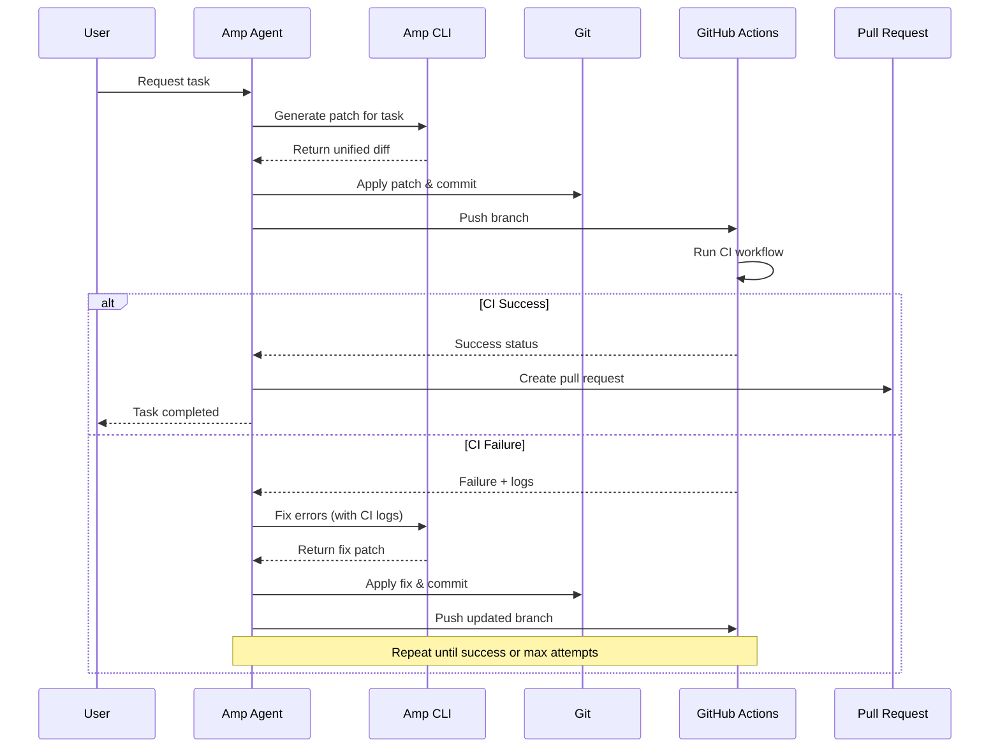

# CI-Feedback Loop Demo

A demonstration of using Continuous Integration as a feedback loop for AI agents to make code changes without requiring local code execution.

## Overview

This demo shows how an AI agent (Amp CLI) can:
1. Make code changes based on natural language tasks
2. Push commits to trigger CI
3. Read CI results and logs
4. Make corrections if CI fails
5. Repeat until CI passes
6. Open a pull request

## Architecture



## Components

- [`scripts/amp-agent.sh`](scripts/amp-agent.sh) - Main orchestrator script
- [`.github/workflows/ci.yml`](.github/workflows/ci.yml) - GitHub Actions CI workflow
- [`src/`](src/) - Sample application code with intentional bugs
- [`tests/`](tests/) - Test suite that will catch bugs
- [`scripts/setup-demo.sh`](scripts/setup-demo.sh) - Setup and dependency checking
- [`scripts/examples.sh`](scripts/examples.sh) - Usage examples

## Quick Start

1. **Setup the demo:**
   ```bash
   ./scripts/setup-demo.sh
   ```

2. **Run a simple example:**
   ```bash
   ./scripts/amp-agent.sh \
     --task "fix the power function to handle negative exponents" \
     --repo $(git config --get remote.origin.url)
   ```

3. **View more examples:**
   ```bash
   ./scripts/examples.sh
   ```

## Prerequisites

- **Amp CLI** - The AI coding agent ([installation guide](https://github.com/sourcegraph/amp))
- **GitHub CLI** (`gh`) - For GitHub API access ([installation guide](https://github.com/cli/cli))
- **jq** - For JSON parsing ([installation guide](https://jqlang.github.io/jq/))
- **Git** - Configured with push access to target repository
- **GitHub token** with permissions:
  - `contents:write` (push commits)
  - `pull_requests:write` (create PRs)
  - `actions:read` (read CI status)

## Usage

### Basic Usage
```bash
./scripts/amp-agent.sh --task "TASK_DESCRIPTION" --repo "REPO_URL"
```

### Advanced Options
```bash
./scripts/amp-agent.sh \
  --task "migrate Mocha tests to Vitest" \
  --repo git@github.com:org/repo.git \
  --base-branch develop \
  --max-attempts 3 \
  --dry-run
```

### Available Options

| Option | Description | Default |
|--------|-------------|---------|
| `--task` | Natural language task description | Required |
| `--repo` | Git repository URL (SSH or HTTPS) | Required |
| `--base-branch` | Base branch for pull request | `main` |
| `--max-attempts` | Maximum retry attempts on CI failure | `5` |
| `--poll-interval` | CI status polling interval (seconds) | `30` |
| `--work-dir` | Working directory for cloning | `/tmp/amp-agent-PID` |
| `--dry-run` | Don't push commits or create PR | `false` |

## How It Works

1. **Clone & Branch**: Creates a new branch from the target repository
2. **Generate Patch**: Uses Amp CLI to create code changes based on the task
3. **Apply & Commit**: Applies the patch and commits changes
4. **Push & Monitor**: Pushes to GitHub and monitors CI status
5. **Iterate on Failures**: If CI fails, feeds error logs back to Amp for fixes
6. **Create PR**: Once CI passes, opens a pull request

## Example Tasks

The demo includes a sample JavaScript project with intentional bugs perfect for testing:

- **Bug Fix**: "fix the power function to handle negative exponents"
- **Test Migration**: "migrate tests from Mocha to Vitest"
- **Code Quality**: "add JSDoc comments to all functions"
- **Performance**: "optimize factorial function to use iteration"
- **TypeScript**: "convert JavaScript to TypeScript with type definitions"

## Configuration

Settings can be customized in [`.amp-agent.config`](.amp-agent.config):

```bash
MAX_ATTEMPTS=5
POLL_INTERVAL=30
BASE_BRANCH=main
LOG_SIZE_LIMIT=4000
```

## Safety Features

- **Dry Run Mode**: Test changes without pushing
- **Attempt Limits**: Prevents infinite retry loops
- **Patch Validation**: Checks patches before applying
- **Working Directory Isolation**: Uses temporary directories
- **Cleanup on Exit**: Removes temporary files automatically

## Troubleshooting

### Common Issues

1. **Amp CLI not found**: Install from [sourcegraph/amp](https://github.com/sourcegraph/amp)
2. **GitHub CLI auth**: Run `gh auth login`
3. **Permission denied**: Ensure GitHub token has required scopes
4. **CI timeout**: Increase `--poll-interval` for slow CI workflows

### Debug Mode

Enable verbose logging:
```bash
export DEBUG=1
./scripts/amp-agent.sh --task "your task" --repo "your-repo"
```

## Extending the Demo

### Adding New CI Checks

Modify [`.github/workflows/ci.yml`](.github/workflows/ci.yml) to add:
- Code coverage requirements
- Security scanning
- Performance benchmarks
- Custom validation steps

### Custom Agent Behaviors

The orchestrator script can be extended to:
- Support multiple programming languages
- Integrate with different CI systems (GitLab, CircleCI, etc.)
- Add Slack/email notifications
- Implement approval workflows
